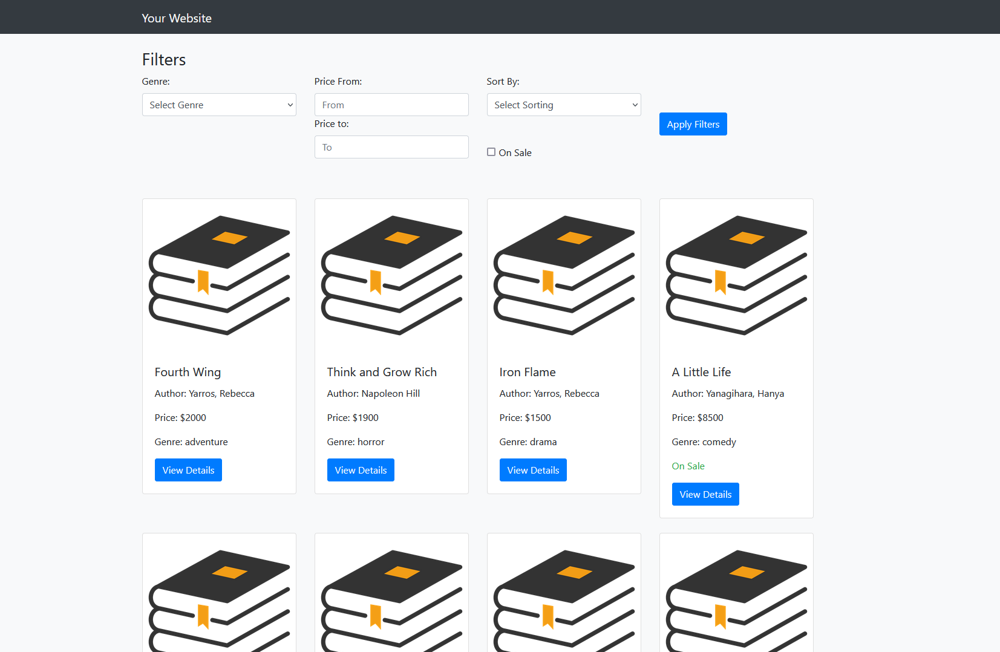
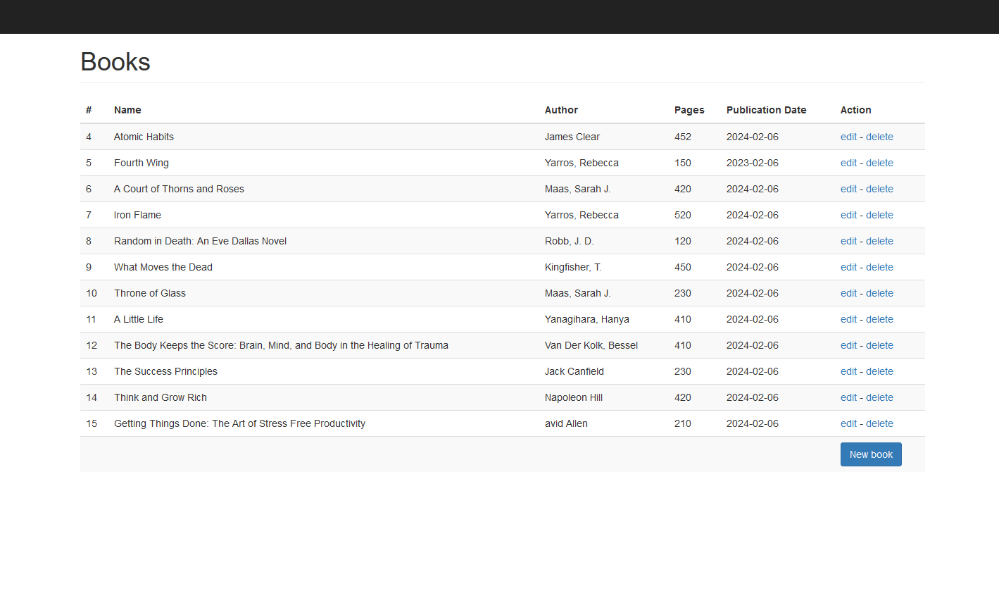
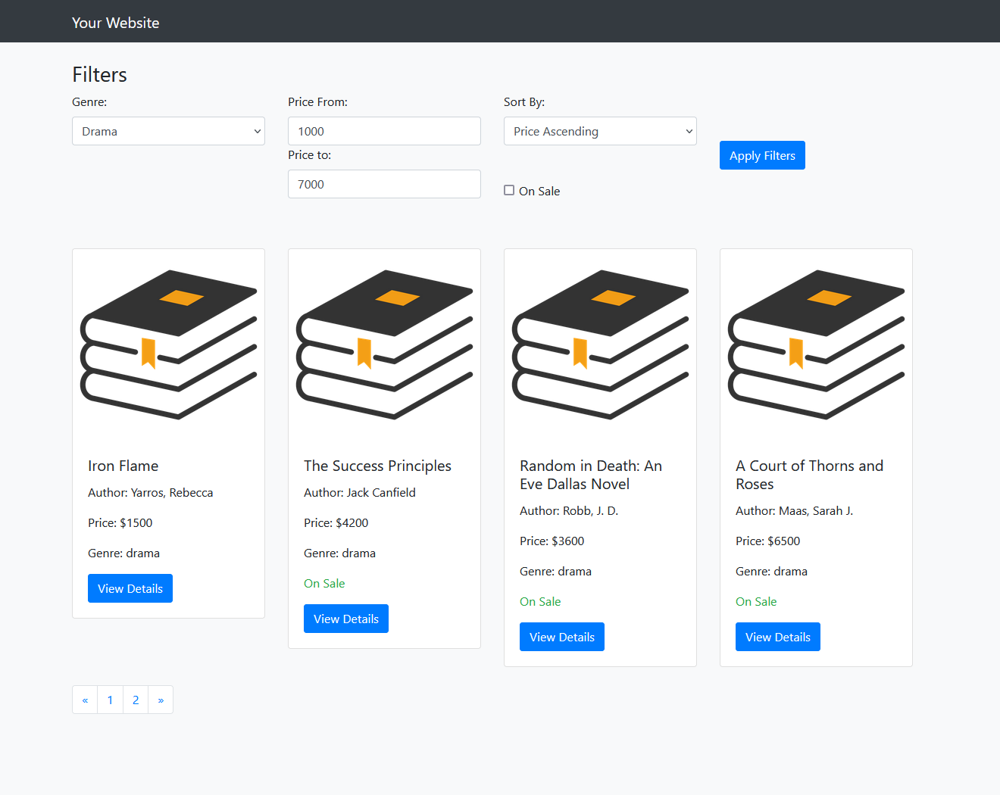
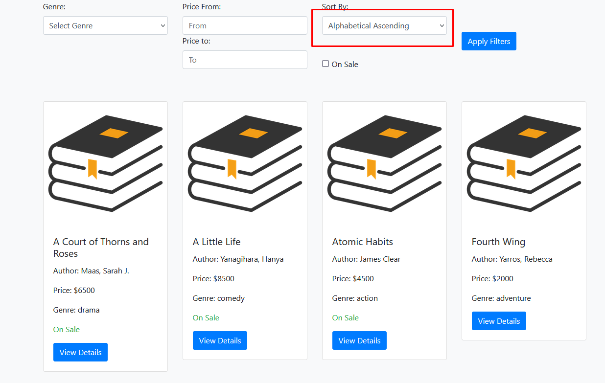

# Go Web Application: Bookstore Management System



The Go Web Application: Bookstore Management System is a web-based application built using Go programming language. It provides functionalities for managing a bookstore, including adding, updating, and deleting books, user authentication, filtering books by various criteria, sorting them, and displaying them in paginated views. The system ensures stable operation through structured logging, error handling, rate limiting, and graceful shutdown mechanisms. It aims to provide a seamless user experience while efficiently managing bookstore operations.


## Table of Contents

- [Introduction](#introduction)
- [Features](#features)
    - [Filtering](#filtering)
    - [Sorting](#sorting)
    - [Pagination](#pagination)
    - [Authentication and Authorization](#Authentication-and-Authorization)
    - [Structured Logging](#structured-logging)
    - [Error Handling](#error-handling)
    - [Rate Limiting](#rate-limiting)
    - [Graceful Shutdown](#graceful-shutdown)
- [Installation](#installation)
- [Usage](#usage)
- [License](#license)

## Introduction

The Bookstore Management System is a web application designed to streamline bookstore operations by providing tools for inventory management, sales tracking, and customer interactions. It offers features for adding, updating, and deleting books, as well as listing available books and viewing detailed information about each book. The system includes user authentication and authorization for secure access, along with functionalities such as filtering, sorting, and pagination to enhance user experience.

**Purpose and Goals:**
- Efficiently manage book inventory, sales, and revenue tracking.
- Provide a user-friendly interface for bookstore staff.
- Implement security measures for data protection.
- Enhance user experience with filtering, sorting, and pagination.
- Ensure system stability and reliability through error handling and structured logging.
- Implement rate limiting to prevent overload and graceful shutdown for proper termination of operations.

## Features

### Filtering


The system allows users to filter data based on specific criteria. For example, users can filter books by genre, publication date, or author name. This functionality helps users to narrow down search results and find relevant information more efficiently.



```go
func handleListProducts(w http.ResponseWriter, r *http.Request) {
    // Retrieve filtering parameters from the URL query
    genre := r.URL.Query().Get("genre")
    onSale := r.URL.Query().Get("onSale")

    // Construct SQL query based on filtering parameters
    query := "SELECT * FROM products WHERE 1=1"
    if genre != "" {
        query += " AND genre = '" + genre + "'"
    }
    if onSale != "" {
        query += " AND onSale = '" + onSale + "'"
    }

    // Execute the query and retrieve filtered products
    products, err := db.Query(query)
    if err != nil {
        renderErrorPage(w, err)
        return
    }

    // Render the filtered products to the user interface
    renderProductsPage(w, products)
}

```

### Sorting

Allow users to sort data in ascending or descending order based on certain attributes. For example:



```go
// Example sorting by price in ascending order
http.HandleFunc("/products", func(w http.ResponseWriter, r *http.Request) {
    sortBy := r.URL.Query().Get("sortBy")
    switch sortBy {
    case "priceASC":
        // Apply sorting logic by price in ascending order
    }
})
```
### Pagination
Pagination enhances user experience by breaking down large datasets into multiple pages, allowing users to navigate through the data more efficiently.


```go
func handleListProducts(w http.ResponseWriter, r *http.Request) {
    // Retrieve pagination parameters from the URL
    page := r.URL.Query().Get("page")
    pageSize := 10 // Number of items per page

    // Parse page number from the request
    pageNumber, err := strconv.Atoi(page)
    if err != nil || pageNumber < 1 {
        pageNumber = 1 // Default to first page if page parameter is invalid
    }

    // Calculate offset based on the page number and page size
    offset := (pageNumber - 1) * pageSize

    // Query the database to retrieve paginated data
    products, err := getProductsPage(offset, pageSize)
    if err != nil {
        renderErrorPage(w, err)
        return
    }

    // Render the page with the paginated data
    renderProductPage(w, products)
}

```

### Authentication and Authorization
Implement authentication and authorization to control access to resources and ensure secure interactions within the system


#### Authentication
Authenticate users to verify their identities before granting access to protected resources. This involves validating user credentials such as username and password.

```go
func loginHandler(w http.ResponseWriter, r *http.Request) {
    username := r.FormValue("username")
    password := r.FormValue("password")

    // Validate username and password against stored credentials
    if username != "" && password != "" {
        // Query the database to retrieve stored password hash for the username
        var storedPasswordHash string
        err := db.QueryRow("SELECT password_hash FROM users WHERE username = ?", username).Scan(&storedPasswordHash)
        if err != nil {
            http.Error(w, "Invalid username or password", http.StatusUnauthorized)
            return
        }

        // Compare the stored password hash with the provided password
        err = bcrypt.CompareHashAndPassword([]byte(storedPasswordHash), []byte(password))
        if err != nil {
            http.Error(w, "Invalid username or password", http.StatusUnauthorized)
            return
        }

        // Authentication successful, proceed to authorize user
        // ...
    }
}

```
#### Authorization
Authorize authenticated users to perform specific actions or access certain resources based on their roles or permissions.
```go
func isAdmin(user *User) bool {
// Check if the user is an administrator based on their role or other criteria
return user.Role == "admin"
}

func handleAdminDashboard(w http.ResponseWriter, r *http.Request) {
user := getCurrentUser(r)
if user == nil || !isAdmin(user) {
http.Error(w, "Unauthorized", http.StatusForbidden)
return
}

// Render the admin dashboard for authorized users
renderAdminDashboard(w, user)
}

```

### Structured Logging

Utilize structured logging to provide detailed information about system events and errors. Structured logging enhances log readability and analysis by organizing log messages into key-value pairs, making it easier to search, filter, and analyze log data.

```go
func handleSaveBook(w http.ResponseWriter, r *http.Request) {
    log.WithFields(logrus.Fields{
        "method": r.Method,
        "path":   r.URL.Path,
    }).Info("Handling save book request")

    // Perform book saving logic

    if err != nil {
        log.WithError(err).Error("Failed to save book")
        renderErrorPage(w, err)
        return
    }

    // Log successful book save
    log.Info("Book saved successfully")
}

```

### Error Handling

Handle errors gracefully by checking for errors after each action and logging relevant information. Proper error handling ensures robustness and reliability in your application, helping to identify and resolve issues efficiently.

```go
func handleSaveBook(w http.ResponseWriter, r *http.Request) {
    // Perform book saving logic
    if err != nil {
        log.WithError(err).Error("Failed to save book")
        renderErrorPage(w, err)
        return
    }

    // Log successful book save
    log.Info("Book saved successfully")
}

```

### Rate Limiting

Implement rate limiting to prevent overload and ensure stable operation of the system. Rate limiting restricts the number of requests a client can make within a specified time frame, helping to manage server resources and maintain performance under heavy load.

```go
import (
    "golang.org/x/time/rate"
    "net/http"
)

var limiter = rate.NewLimiter(1, 3) // Rate limit of 1 request per second with a burst of 3 requests

func main() {
    http.HandleFunc("/", func(w http.ResponseWriter, r *http.Request) {
        if !limiter.Allow() {
            // Exceeded request limit
            http.Error(w, "Rate limit exceeded", http.StatusTooManyRequests)
            return
        }
        // Request processing
    })

    http.ListenAndServe(":8080", nil)
}

```

### Graceful Shutdown

Graceful shutdown is crucial for ensuring that server operations are completed safely and that no data loss occurs when terminating a server. It involves gracefully stopping the server, allowing active connections to finish processing before shutting down completely.

```go
import (
    // importing all necessary packages
)

func main() {
    quit := make(chan os.Signal, 1)
    signal.Notify(quit, os.Interrupt, syscall.SIGTERM)

    srv := &http.Server{Addr: ":8080"}

    go func() {
        if err := srv.ListenAndServe(); err != nil && err != http.ErrServerClosed {
            log.Fatalf("ListenAndServe(): %v", err)
        }
    }()

    <-quit
    log.Println("Server is shutting down...")

    ctx, cancel := context.WithTimeout(context.Background(), 5*time.Second)
    defer cancel()

    if err := srv.Shutdown(ctx); err != nil {
        log.Fatalf("Server forced to shutdown: %v", err)
    }

    log.Println("Server exited gracefully")
}

```

## Installation

1. Clone the repository:
```bash
git clone https://github.com/Atabek04/bookstore-go.git
```
2. Navigate to the project directory:
```bash
cd project
```
3. Install dependencies:
```bash
go mod tidy
```

## Usage

1. Start the server:
```bash
go run main.go
```
2. Access the application in your web browser at `http://localhost:8080`.


## License

This project is licensed under the [MIT License](https://opensource.org/licenses/MIT).